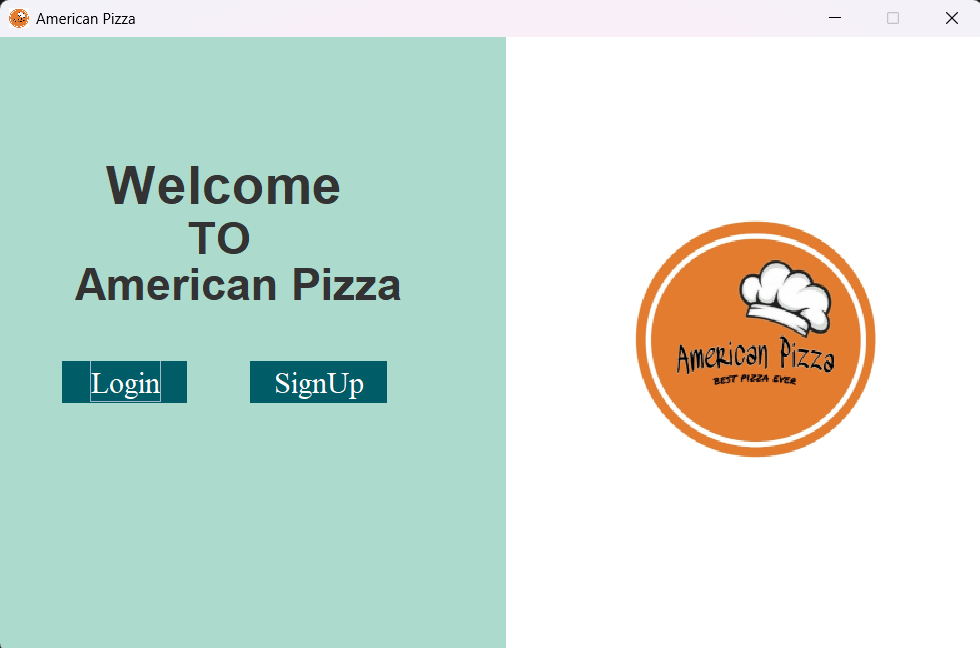
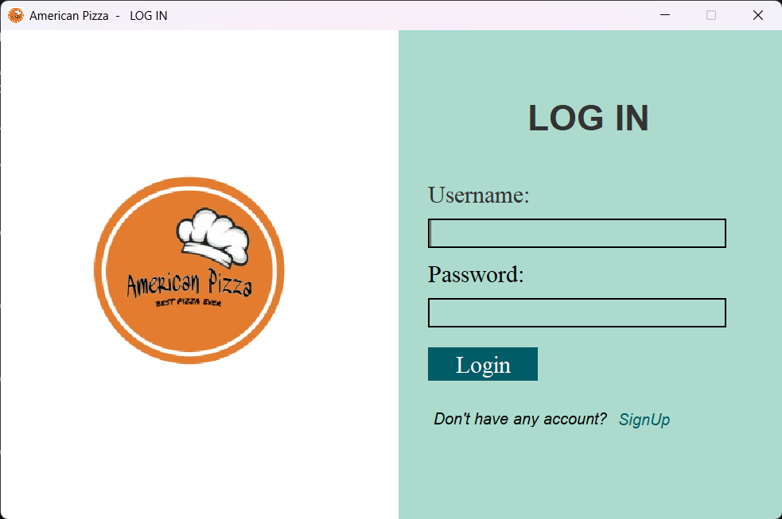
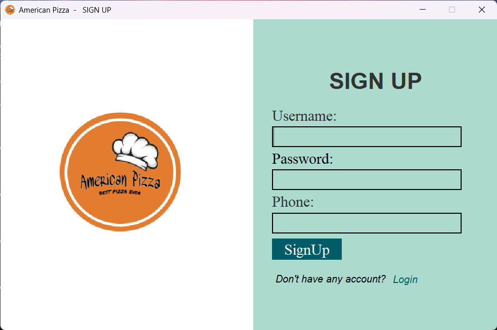
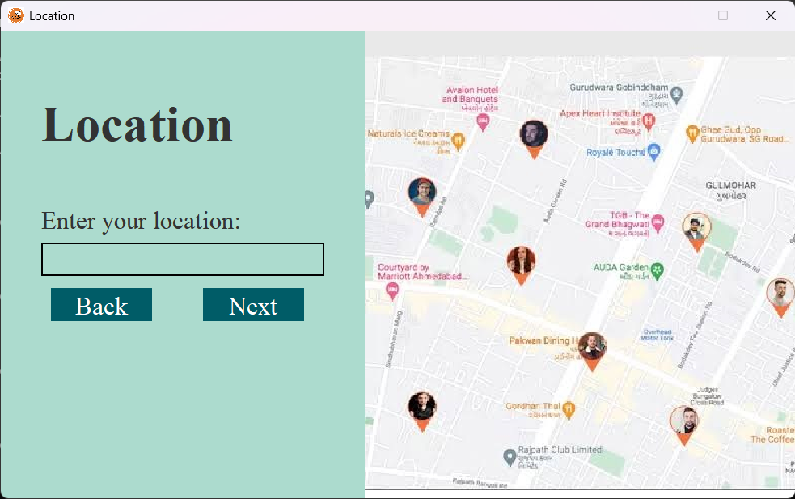
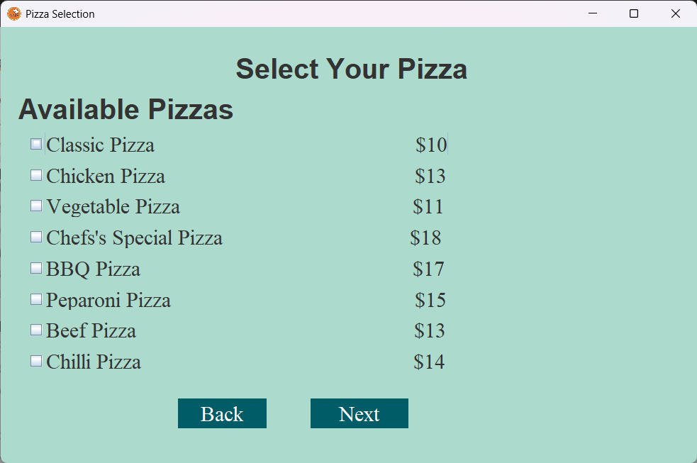
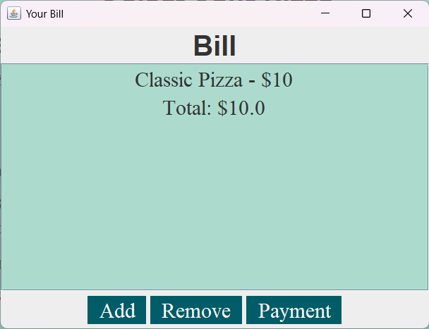
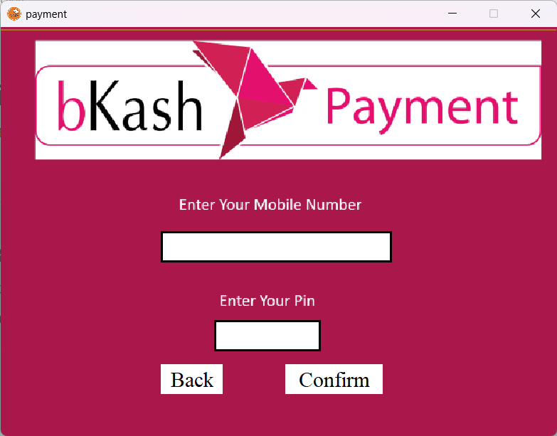
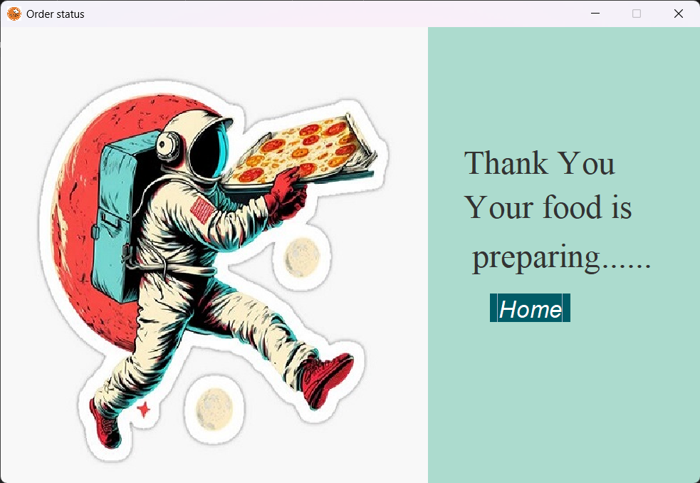

# 🍕 American Pizza — Desktop Ordering App

A Java Swing desktop application that simulates a full pizza ordering experience — from login/signup, to entering a delivery location, choosing pizzas, reviewing the bill, and paying via a **bKash**-style mobile payment flow.


---

## ✨ Features

- 🏠 **Welcome Screen** — Branded landing page with Login / Sign Up options
- 🔐 **Login & Sign Up** — Username/password authentication, with phone number captured at sign-up
- 📍 **Location Selection** — Enter delivery location with an interactive map view
- 🍕 **Pizza Selection** — Choose from a full menu (Classic, Chicken, Vegetable, Chef's Special, BBQ, Pepperoni, Beef, Chilli) with live pricing
- 🧾 **Bill Summary** — Add/remove items and see the running total before payment
- 💳 **bKash Payment Integration (simulated)** — Enter mobile number & PIN to confirm payment
- ✅ **Order Confirmation** — Friendly "Thank You" screen once the order is placed

---

## 🖥️ Screenshots

### Welcome Screen


### Login


### Sign Up


### Location Selection


### Pizza Selection


### Bill


### Payment (bKash)


### Order Status


---

## 🛠️ Tech Stack

| Component     | Technology         |
|---------------|---------------------|
| Language      | Java                |
| UI Framework  | Java Swing          |
| IDE           | [e.g. IntelliJ IDEA / Eclipse / NetBeans] |
| Database      | [e.g. MySQL — update if applicable] |

## 🚀 Getting Started

### Prerequisites
- JDK 8 or later installed
- [Your IDE of choice] (IntelliJ IDEA, Eclipse, or NetBeans)

### Installation & Run
```bash
git clone https://github.com/Ruhin10/American_Pizza.git
cd American_Pizza/American\ Pizza
```
1. Open the project in your Java IDE.
2. [Add any DB setup step here if the app uses a database for users/orders]
3. Run the main class to launch the Welcome screen.

## 📁 Project Flow

```
Welcome Screen
   ├── Login ──────► Location ──► Pizza Selection ──► Bill ──► bKash Payment ──► Order Status
   └── Sign Up ────► Location ──► Pizza Selection ──► Bill ──► bKash Payment ──► Order Status
```

## 👥 Contributors

- **Ruhin** and team

## 📄 License

This project was developed for academic/learning purposes.
